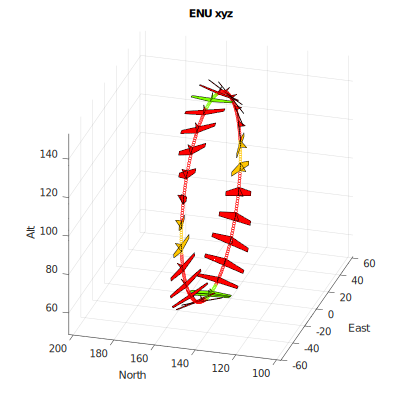
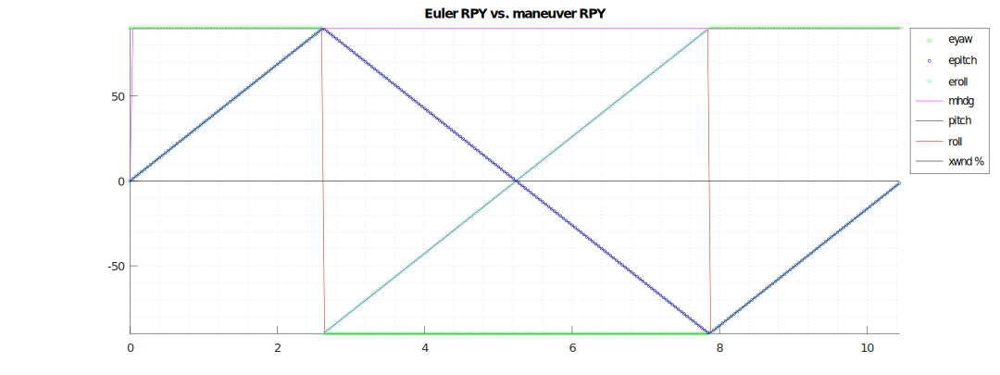

# Euler roll/yaw problems with crosswind

## rolling loop OK with no crosswind
### 3D view of maneuver showing level entry, rolling right through a total of 360 degrees. Color code shows upright and level as green, knife-edge is yellow and inverted is blue. Roll tolerance is 10 degrees; anything more than 19 degrees from upright, inverted or knife-edge is coded red.

### 3D view of rolling loop with crosswind of 5 m/sec from the South (wind velocity (5,0,0) in ENU frame). View from above showing yaw (to South) required for wind correction.

## Euler RPY differs from "manevuer plane" RPY when crosswind is present

### but one can calculate the "correct" roll angle given the correct maneuver heading and the maneuver heading will be either along or across the aerobatic box

